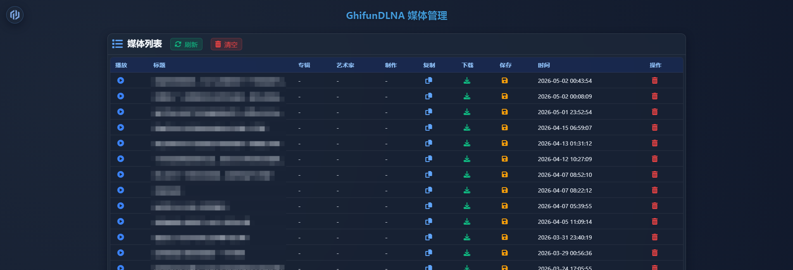
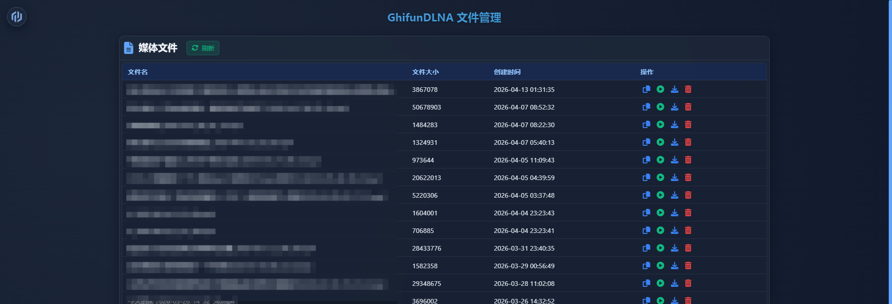

# GDLNA - DLNA 投屏链接捕获工具

[](https://golang.org)
[](LICENSE)

GDLNA 是一个用 Go 语言开发的 DLNA 投屏链接捕获工具。它模拟 DLNA MediaRenderer 设备，拦截并提取来自手机、平板等设备的投屏请求中的媒体地址，方便用户获取视频/音频的真实播放链接。

## 📷 界面预览

<table>
<tr>
<td align="center"><strong>媒体列表</strong></td>
<td align="center"><strong>文件管理</strong></td>
</tr>
<tr>
<td></td>
<td></td>
</tr>
</table>

## ✨ 功能特性

- **DLNA 投屏链接捕获**
  - 模拟 UPnP MediaRenderer 设备，接收投屏请求
  - 自动提取投屏视频/音频的真实播放地址
  - 支持 SSDP 发现协议（M-SEARCH 响应 & NOTIFY 主动通知）

- **Web 管理界面**
  - 直观的 Web 控制面板
  - 查看和管理捕获到的投屏链接列表
  - 媒体文件下载功能
  - 文件管理（删除、查看等）

- **数据持久化**
  - 使用 SQLite 数据库存储捕获的投屏链接
  - WAL 模式支持，提高并发性能

- **跨平台支持**
  - Windows
  - Linux
  - Docker 容器化部署

## 📦 技术栈

- **语言**: Go 1.23+
- **Web 框架**: Echo
- **数据库**: SQLite (modernc.org/sqlite)
- **XML 处理**: beevik/etree
- **配置管理**: go-ini/ini

## 🚀 快速开始

### 前置要求

- Go 1.23 或更高版本
- 网络环境支持 UPnP/DLNA 协议

### 本地运行

1. 克隆项目
```bash
git clone https://github.com/BillGhifun/GDLNA.git
cd GDLNA
```

2. 安装依赖
```bash
go mod download
```

3. 配置 `Config.ini`（可选）
```ini
[server]
ADDRESS     = 192.168.1.10   ; 服务器地址
HTTP_PORT   = 8181           ; HTTP 端口
DEVICE_NAME = GDLNA Server   ; DLNA 设备名称
```

4. 运行程序
```bash
# 正常模式
go run main.go

# 调试模式（使用当前工作目录作为根目录）
set DEBUG=1   # Windows
go run main.go
```

### Docker 部署

1. 构建镜像
```bash
docker build -t gdlna .
```

2. 运行容器
```bash
docker run -d \
  --name gdlna \
  --network=host \
  -v /path/to/movies:/gdlna/movies \
  -v /path/to/db:/gdlna/db \
  gdlna
```

> **注意**: DLNA 需要使用 host 网络模式，以便正确加入 UPnP 多播组。

## ⚙️ 配置说明

配置文件 `Config.ini` 支持以下选项：

| 配置项 | 说明 | 默认值 |
|--------|------|--------|
| `ADDRESS` | 服务器 IP 地址 | 192.168.1.10 |
| `HTTP_PORT` | HTTP 服务端口 | 8181 |
| `DEVICE_NAME` | DLNA 设备显示名称 | GDLNA IP:端口 |

## 📖 使用说明

### 1. 启动服务

启动后，GDLNA 会自动：
- 加入 UPnP 多播组（239.255.255.250:1900）
- 响应 SSDP M-SEARCH 发现请求
- 定期发送 SSDP NOTIFY 保活通知

### 2. 发现设备

在同一局域网下，打开支持 DLNA 的应用（如视频播放器、相册等），搜索 DLNA 设备，即可发现 GDLNA 服务器。

### 3. Web 管理界面

访问 `http://服务器IP:8181` 打开 Web 管理界面：

- **首页**: 查看捕获到的投屏链接列表
- **文件管理**: 管理下载的媒体文件
- **设置**: 配置服务器参数

### 4. 捕获投屏链接

1. 在手机/平板上打开支持 DLNA 的视频应用（如腾讯视频、爱奇艺等）
2. 点击投屏按钮，搜索到 GDLNA 设备
3. 选择要投屏的媒体，GDLNA 会自动捕获投屏链接并提取真实播放地址
4. 在 Web 界面可以查看、下载或删除捕获到的链接

## 📁 项目结构

```
GDLNA/
├── main.go              # 程序入口
├── Config.ini           # 配置文件
├── cfg/                 # 配置管理
├── dlna/                # DLNA 协议实现
│   ├── dlna.go         # SSDP 发现 & 设备描述
│   └── http.go         # Web 服务 & API
├── dlnadb/              # 数据库操作
├── dnslogger/           # 日志模块
├── fm/                  # 文件管理
├── getdata/             # 数据解析
├── httpdown/            # HTTP 下载
├── system/              # 系统工具
├── www/                 # Web 静态资源
├── movies/              # 媒体文件存储
└── db/                  # 数据库文件
```

## 🔌 API 接口

| 接口 | 方法 | 说明 |
|------|------|------|
| `/dlna/desc.xml` | GET | 获取设备描述 XML |
| `/media_get_list` | GET | 获取投屏链接列表 |
| `/media_del?id=N` | GET | 删除指定索引的链接 |
| `/media_clear_all` | GET | 清空所有链接 |
| `/save_media?id=N` | GET | 下载指定链接的媒体 |
| `/file_get_list` | GET | 获取媒体文件列表 |
| `/file_del?name=X` | GET | 删除指定媒体文件 |
| `/openvideo?videoUrl=X` | GET | 打开视频播放页面 |

## 🐛 调试

程序运行时会输出日志信息：

- 设备启动信息
- SSDP 发现请求（相同 IP+类型 2 秒内去重）
- 投屏链接捕获记录
- 错误信息

## 📝 开发计划

- [ ] 支持更多 DLNA 服务
- [ ] 实时转码功能
- [ ] 多语言支持
- [ ] 移动端适配

## 🤝 贡献

欢迎提交 Issue 和 Pull Request！

## 📄 许可证

本项目采用 MIT 许可证 - 查看 [LICENSE](LICENSE) 文件了解详情。

## 🙏 致谢

感谢所有开源项目的贡献！

---

**作者**: BillGhifun  
**项目地址**: https://github.com/BillGhifun/GDLNA
